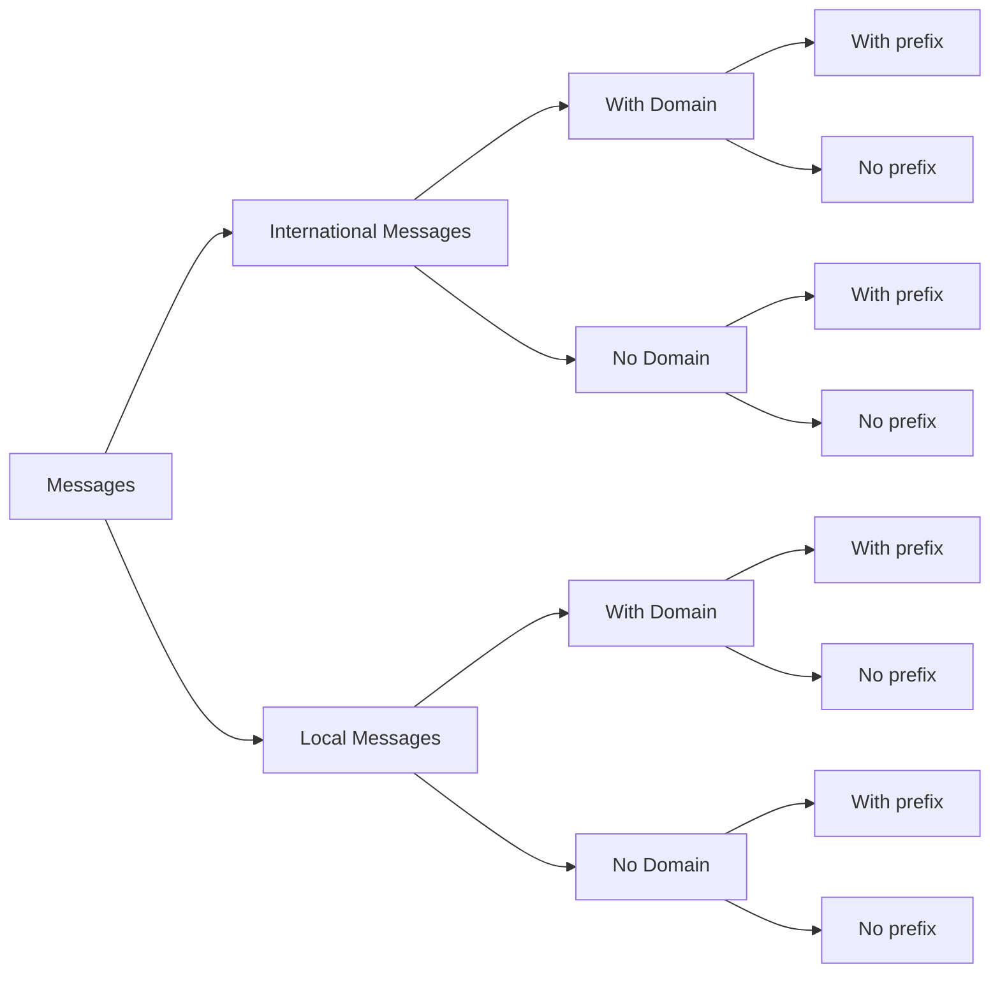

Voip.ms

Prefix - Country Code

```mermaid
graph LR
A[Messages] --> B[International Messages]
A --> C[Local Messages]
B --> D[With Domain]
B --> E[No Domain]
D --> F[With prefix]
D --> G[No prefix]
E --> H[With prefix]
E --> I[No prefix]
C --> J[With Domain]
C --> K[No Domain]
J --> L[With prefix]
J --> M[No prefix]
K --> N[With prefix]
K --> O[No prefix]
```

